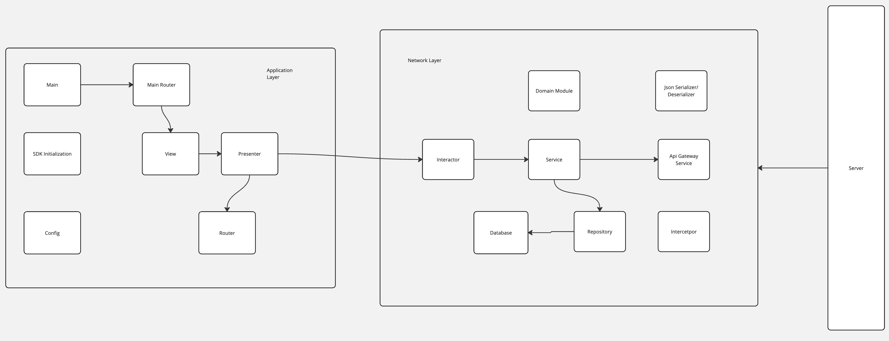

# LightSpeed Pic Saver

This is a simple iOS app that fetches random images from an API, displays them in a list, and allows users to manage the content by adding, deleting, and reordering items. The app is built using UIKit and leverages Swift Package Manager (SPM) for dependency management.

## Features

- **Fetch Random Images**: The app fetches random images from the [Picsum API](https://picsum.photos/v2/list) and displays them in a list.
- **Persistence**: The fetched images are saved locally and appended to the bottom of the list.
- **UI Updates**: The UI updates dynamically as new items are added.
- **Content Management**: Users can delete and reorder items in the list.
- **Swift Package Manager**: The app uses SPM for managing dependencies .
- **Testing**: Includes unit tests to ensure the app's functionality.

## Getting Started

### Prerequisites

- Xcode 14.0 or later
- iOS 17.0 or later

### Installation

1. Clone the repository:
   ```bash
   git clone https://github.com/DrDijkstra/LightSpeed.git
   ```
2. Open the project in Xcode:
   ```bash
   cd LightSpeed
   open LSPicSaver.xcodeproj
   ```
3. Build and run the project on the simulator or a physical device.

## Usage

1. **Fetch and Save**: Tap the "Add Button" button to fetch a random image from the API. The image and its author will be saved locally and added to the list.
2. **Delete Items**: Tap on the top right corder delete buttton to delete it.
3. **Reorder Items**: Tap and hold an item to drag and reorder it within the list.

## Architecture

The architecture depicted in the diagram follows the VIPER pattern, commonly used in iOS development to separate concerns and improve code organization. Here's a brief overview of the architecture:

### Application Layer:
1. **Main**: This is likely the entry point of the application, responsible for setting up the initial environment and launching the main features.
2. **SDK Initialization**: Handles the initialization of any SDKs or third-party services used in the app.
3. **Config**: Manages configuration settings and environment variables.
4. **Main Router**: Directs navigation and flow within the app, possibly coordinating the initial setup.
5. **View**: The user interface layer that interacts with the user and displays information.
6. **Presenter**: Acts as a mediator between the View and the Interactor, handling the business logic and preparing data to be displayed by the View.
7. **Router**: Manages navigation between different screens or modules within the app.

### Network Layer:
1. **Interactor**: Handles the business logic and communicates with the network layer. It receives requests from the Presenter and interacts with services or repositories to fetch or modify data.
2. **Service**: Provides the actual implementation for network requests, interacting with APIs or other network services.
3. **Repository**: Manages data persistence, typically abstracting the details of data storage and retrieval. It may interact with both local databases and remote servers.
4. **Database**: Manages local data storage, using Core Data.
5. **Api Gateway Service**: Central point for managing API requests, possibly handling authentication, caching, and other network-related tasks.
6. **Interceptor**: Manages HTTP request and response interception, often used for handling authentication tokens, logging, or modifying requests.
7. **Json Serializer/Deserializer**: Handles the conversion between JSON data and Swift models, ensuring proper encoding and decoding.
8. **Domain Module**: Represents the core business logic and entities of the app, ensuring separation of concerns and reusability.

### Server:
- **Server**: Represents the external backend services that the app communicates with via the network layer.

This architecture provides a clear separation of concerns, allowing each component to focus on a specific responsibility, which improves maintainability, testability, and scalability of the iOS application.


## Testing

The app includes unit tests for key functionalities, such as:

- Fetching random images from the API
- Saving and retrieving images locally
- Managing the list (adding, deleting, reordering)

To run the tests:

1. Open the project in Xcode.
2. Select the "LSPicSaverTests" scheme.
3. Press `Command + U` to run the tests.

## Dependencies

- [Alamofire](https://github.com/Alamofire/Alamofire) 
- [Kingfisher](https://github.com/onevcat/Kingfisher) 
- [XCoordinator](https://github.com/quickbirdstudios/XCoordinator) 
- [CHTCollectionViewWaterfallLayout](https://github.com/chiahsien/CHTCollectionViewWaterfallLayout)


## Acknowledgments

- Thanks to [Picsum](https://picsum.photos) for providing the free image API.

